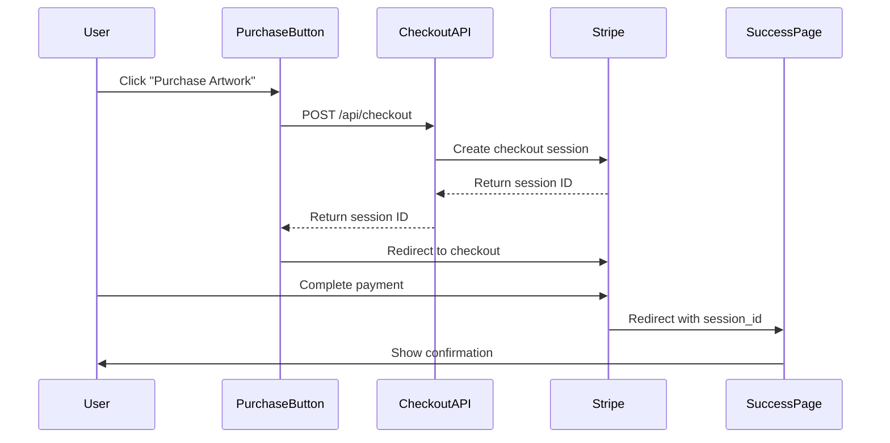

# Stripe Architecture for Selling Products

This document explains the architecture and implementation of Stripe-based product sales in the EONMUN platform.

## Overview

The EONMUN platform integrates with Stripe to enable secure artwork purchases. The system supports selling digital artworks with certificates of authenticity through a streamlined checkout process.

## Architecture Components

### 1. Frontend Components

#### Stripe Client (`web/src/lib/stripe.ts`)
- **Purpose**: Initialize Stripe.js on the client side
- **Key Features**:
  - Singleton pattern for Stripe instance
  - Publishable key configuration
  - Static pricing configuration ($1000 per artwork)

```typescript
export const getStripe = () => {
  if (!stripePromise) {
    stripePromise = loadStripe(process.env.NEXT_PUBLIC_STRIPE_PUBLISHABLE_KEY!);
  }
  return stripePromise;
};
```

#### Purchase Button (`web/src/components/PurchaseButton.tsx`)
- **Purpose**: UI component for initiating artwork purchases
- **Key Features**:
  - Loading states and error handling
  - Artwork metadata integration
  - Stripe Checkout redirection
  - Responsive design with Material Design 3 theming

#### Success Page (`web/src/app/purchase/success/page.tsx`)
- **Purpose**: Post-purchase confirmation and next steps
- **Key Features**:
  - Transaction ID display
  - Purchased artwork details
  - Certificate of authenticity information
  - User guidance for next steps

### 2. Backend API

#### Checkout API (`web/src/app/api/checkout/route.ts`)
- **Purpose**: Server-side Stripe session creation
- **Key Features**:
  - Stripe session configuration
  - Artwork metadata handling
  - Success/cancel URL routing
  - Error handling and validation

```typescript
const session = await stripe.checkout.sessions.create({
  payment_method_types: ['card'],
  line_items: [{
    price_data: {
      currency: 'usd',
      product_data: {
        name: artworkTitle,
        description: 'Digital artwork with certificate of authenticity',
      },
      unit_amount: price * 100, // Convert to cents
    },
    quantity: 1,
  }],
  mode: 'payment',
  success_url: `${appUrl}/purchase/success?session_id={CHECKOUT_SESSION_ID}&artwork_slug=${artworkSlug}`,
  cancel_url: `${appUrl}/artworks/${artworkSlug}?canceled=true`,
  metadata: { artworkId, artworkSlug },
});
```

## Data Flow

### Purchase Flow



### 1. Purchase Initiation
1. User clicks "Purchase Artwork" button
2. `PurchaseButton` component gathers artwork metadata
3. POST request sent to `/api/checkout` with:
   - `artworkId`: Strapi document ID
   - `artworkTitle`: Display name
   - `artworkSlug`: URL identifier
   - `price`: Fixed $1000 amount

### 2. Stripe Session Creation
1. Checkout API validates request data
2. Creates Stripe checkout session with:
   - Product information (name, description)
   - Pricing in cents ($1000 = 100000 cents)
   - Success/cancel URLs with artwork context
   - Metadata for tracking

### 3. Payment Processing
1. User redirected to Stripe Checkout
2. Stripe handles payment collection
3. On success: redirect to `/purchase/success`
4. On cancel: redirect back to artwork page

### 4. Post-Purchase
1. Success page displays transaction confirmation
2. Artwork details shown for reference
3. Next steps communicated to user
4. Transaction ID provided for records

## Environment Configuration

### Required Environment Variables

#### Frontend (`.env`)
```env
NEXT_PUBLIC_STRIPE_PUBLISHABLE_KEY=pk_test_...
NEXT_PUBLIC_APP_URL=http://localhost:3000
```

#### Backend (`.env`)
```env
STRIPE_SECRET_KEY=sk_test_...
```

### Development vs Production

- **Development**: Use Stripe test keys (pk_test_, sk_test_)
- **Production**: Use Stripe live keys (pk_live_, sk_live_)
- **Webhooks**: Not currently implemented but recommended for production

## Product Model

### Current Implementation
- **Fixed Pricing**: All artworks cost $1000
- **Single Product Type**: Digital artwork + certificate
- **No Inventory Tracking**: Digital products don't require stock management
- **Metadata Driven**: Product details sourced from Strapi artwork data

### Product Data Structure
```typescript
interface CheckoutRequestBody {
  artworkId: string;      // Strapi document ID
  artworkTitle: string;   // Display name for Stripe
  artworkSlug: string;    // URL identifier
  price: number;          // Price in dollars (converted to cents)
}
```

## Security Considerations

### Current Implementation
- ✅ **API Key Security**: Secret key only on server-side
- ✅ **Request Validation**: Server validates all checkout requests
- ✅ **Stripe Hosted**: Payment forms hosted by Stripe (PCI compliant)
- ✅ **HTTPS Required**: Stripe requires HTTPS in production

### Missing Security Features
- ❌ **Webhook Validation**: No webhook signature verification
- ❌ **Idempotency**: No duplicate payment prevention
- ❌ **Rate Limiting**: No API rate limiting implemented
- ❌ **User Authentication**: Purchases not tied to user accounts

## Potential Enhancements

### 1. Webhook Integration
Implement Stripe webhooks for reliable payment confirmation:

```typescript
// web/src/app/api/webhooks/stripe/route.ts
export async function POST(request: NextRequest) {
  const signature = request.headers.get('stripe-signature');
  const payload = await request.text();
  
  const event = stripe.webhooks.constructEvent(
    payload,
    signature,
    process.env.STRIPE_WEBHOOK_SECRET
  );
  
  if (event.type === 'checkout.session.completed') {
    // Handle successful payment
    // Update database, send emails, etc.
  }
}
```

### 2. Dynamic Pricing
Allow different prices per artwork:

```typescript
// In Strapi artwork model
interface Artwork {
  // ... existing fields
  price?: number; // Optional custom price
  isForSale: boolean; // Toggle availability
}
```

### 3. User Account Integration
Link purchases to user accounts:

```typescript
// Add to checkout session
customer_email: user.email,
metadata: {
  userId: user.id,
  artworkId,
  // ... other metadata
}
```

### 4. Inventory Management
Track digital artwork "editions":

```typescript
interface ArtworkEdition {
  artworkId: string;
  editionNumber: number;
  totalEditions: number;
  isSold: boolean;
  purchaseDate?: Date;
}
```

### 5. Subscription Products
Support for recurring payments:

```typescript
// For membership or subscription artworks
mode: 'subscription',
line_items: [{
  price: 'price_subscription_id', // Stripe Price ID
  quantity: 1,
}]
```

## Testing

### Test Cards
Stripe provides test card numbers for different scenarios:

- **Success**: `4242424242424242`
- **Decline**: `4000000000000002`
- **3D Secure**: `4000002500003155`

### Testing Checklist
- [ ] Successful payment flow
- [ ] Payment decline handling
- [ ] Network error scenarios
- [ ] Invalid artwork data
- [ ] Missing environment variables
- [ ] Success page rendering
- [ ] Cancel flow behavior

## Monitoring and Analytics

### Recommended Tracking
1. **Payment Success Rate**: Track successful vs failed payments
2. **Revenue Analytics**: Monitor sales by artwork, time period
3. **User Journey**: Track from artwork view to purchase completion
4. **Error Rates**: Monitor API failures and Stripe errors

### Stripe Dashboard
- View real-time transactions
- Monitor failed payments
- Analyze customer behavior
- Generate financial reports

## Compliance

### PCI Compliance
- ✅ **Stripe Hosted**: Payment forms handled by Stripe
- ✅ **No Card Storage**: No card data touches our servers
- ✅ **HTTPS Only**: All communication encrypted

### GDPR Considerations
- Customer data stored by Stripe
- Implement data deletion requests
- Provide data export capabilities
- Update privacy policy accordingly

## Support and Maintenance

### Common Issues
1. **Environment Variables**: Ensure all Stripe keys are properly set
2. **URL Configuration**: Verify success/cancel URLs are accessible
3. **API Versions**: Keep Stripe API version updated
4. **Webhook Endpoints**: Ensure webhooks can reach your server

### Monitoring
- Set up alerts for failed payments
- Monitor Stripe webhook delivery
- Track API response times
- Review Stripe logs regularly

## Conclusion

The current Stripe integration provides a solid foundation for selling digital artworks. The architecture is simple, secure, and user-friendly. Future enhancements should focus on webhook integration, dynamic pricing, and user account management to create a more comprehensive e-commerce solution.